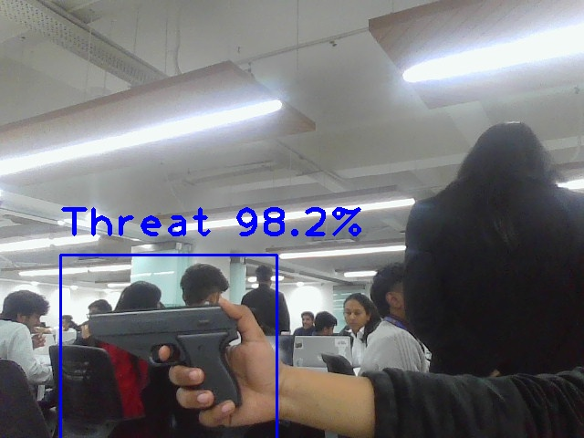
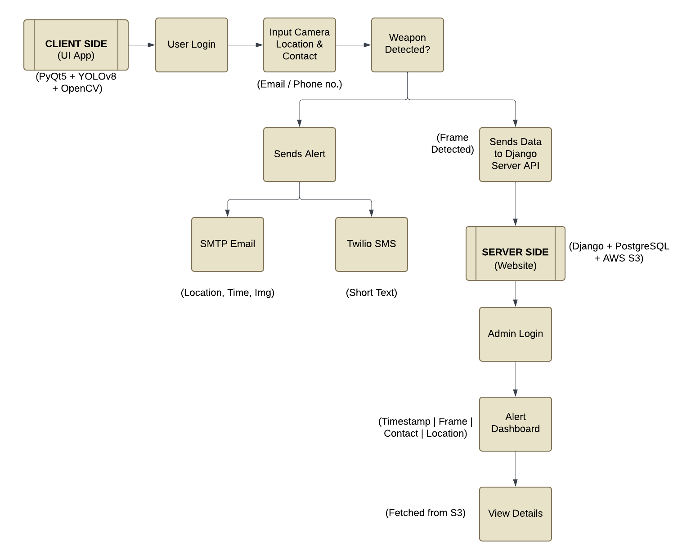

# Threat-Detection (YOLOv8)

## Screenshots


## Workflow


# How to run?
### STEPS:

Clone the repository

```bash
Project repo: https://github.com/CodewithShaily/Nagar-rakshak
```
### STEP 01- Open client_side in a terminal

### STEP 02- install the requirements
```bash
pip install -r requirements.txt
```

```bash
# Finally run the following command
python main.py
```

### STEP 03- Open server_side in a terminal

### Create a `.env` file in the root directory and add your Database credentials as follows:

```ini
SECRET_KEY = 

#SMTP
EMAIL_HOST_USER=
EMAIL_HOST_PASSWORD=

#Twilio
TWILIO_ACCOUNT_SID=
TWILIO_AUTH_TOKEN=
TWILIO_NUMBER= 

#AWS
AWS_ACCESS_KEY_ID=
AWS_SECRET_ACCESS_KEY=

#DATABASE
DB_NAME:
DB_USER:
DB_PASSWORD:
DB_HOST:
```

```bash
# Finally run the following command
python manage.py runserver
```

Now,
```bash
open up localhost:
```

### Techstack Used:

- Python
- QT Designer
- PyTorch
- YOLOv8
- Django
- PostgreSQL


    
=======
